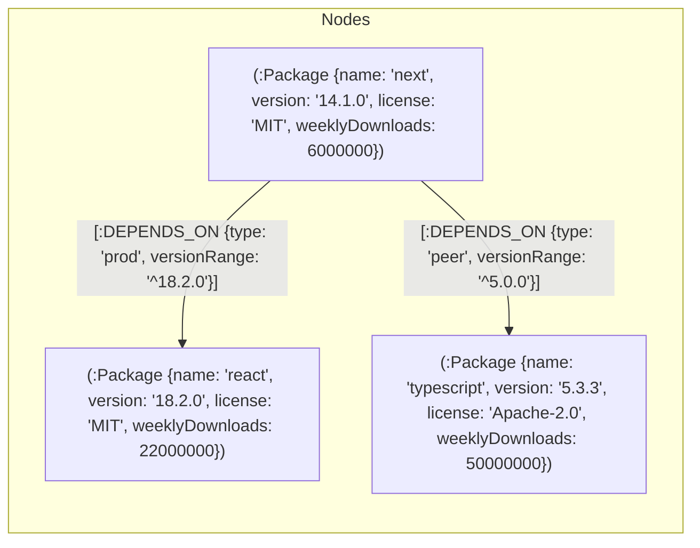

# StackGraph — Tech Dependency Explorer 🔗

> An interactive graph-powered web application for exploring npm package dependency networks, reverse dependents, and circular dependency loops using **CognoDB** (Neo4j-compatible graph database over Bolt protocol).

---

## Overview

Modern software development relies heavily on interconnected package ecosystems like npm. Understanding transitive dependency depth, identifying breaking impacts during package upgrades or removals, and detecting circular dependencies is critical for software supply chain security and architecture stability.

**StackGraph** allows developers to:
- **Search and explore** any package with instant autocomplete and download metrics.
- **Visualize multi-hop dependency graphs** (1, 2, or 3 levels deep) using an interactive force-directed graph with download-heatmap coloring.
- **Inspect reverse dependencies ("What depends on me?")** to immediately see which upstream packages would break if a given library were removed.
- **Detect circular dependencies** in real-time to prevent bundler deadlocks, undefined runtime exports, and memory leaks.

```
+---------------------------------------------------------------------------------------+
|  StackGraph 🔗  [Explorer]  [Circular Deps]                  ● CognoDB Live (Bolt)    |
+---------------------------------------------------------------------------------------+
|  [ 🔍 Search npm packages (e.g., next, react, express)... ]   (9 Nodes | 11 Deps)     |
+-------------------------------------------------------------+-------------------------+
|                                                             | [Package Info]          |
|                 (vite) ──[peer]──> (typescript)             | next @14.1.0            |
|                   │                                         | React framework for     |
|                 [dev]                                       | production              |
|                   ↓                                         |                         |
|   (next) ─────> (react) <───── (react-dom)                  | 📥 6,000,000 /wk        |
|     │             ↑                                         | 🛡️ MIT                  |
|   [prod]          │                                         +-------------------------+
|     ↓             │                                         | Traversal Depth: [1|2|3]|
|  (webpack) ──> (babel-core) ──[prod]──> (lodash)            +-------------------------+
|                                                             | Direct Dependents (0)   |
+-------------------------------------------------------------+-------------------------+
```

---

## Why a graph database?

In relational databases (SQL), dependency trees and networks require self-referencing tables, expensive recursive CTEs (`WITH RECURSIVE`), and multiple joins that degrade exponentially with tree depth. 

| Feature | Relational Database (SQL) | Graph Database (CognoDB / Neo4j) |
| :--- | :--- | :--- |
| **Multi-Hop Traversal (1..N hops)** | Requires deep recursive joins (`JOIN ... JOIN`) or recursive CTEs with high query latency. | **Index-free adjacency**: Relationships are direct pointers. Traverses thousands of hops in milliseconds with `[:DEPENDS_ON*1..N]`. |
| **Reverse Lookup ("What depends on me?")** | Awkward self-joins and table scans on foreign keys. | Trivial single-hop reverse edge traversal `(dependent)-[:DEPENDS_ON]->(target)`. |
| **Cycle Detection** | High complexity; requires tracking visited array paths in SQL to avoid infinite recursion. | Built-in path matching `(p)-[:DEPENDS_ON*2..]->(p)` detects loops natively. |
| **Schema Flexibility** | Rigid table migrations required to introduce new relationship attributes. | Property graph model allows dynamic node and edge properties (e.g. `type: "prod" \| "dev" \| "peer"`). |

---

## Data Model Diagram



### Node Label: `:Package`
- `name` (*string*, unique constraint) — Package name (e.g., `react`)
- `version` (*string*) — Current semantic version (e.g., `18.2.0`)
- `description` (*string*) — Short summary of package purpose
- `license` (*string*) — SPDX license tag (e.g., `MIT`, `Apache-2.0`)
- `weeklyDownloads` (*integer*) — Average weekly download volume

### Relationship Type: `[:DEPENDS_ON]`
- `versionRange` (*string*) — SemVer dependency constraint (e.g., `^18.2.0`)
- `type` (*string*) — Dependency classification: `'prod'` | `'dev'` | `'peer'`

---

## Setup & Run

### Prerequisites
- **Node.js**: v18+ or v20+
- **npm** or **pnpm**
- **CognoDB** instance (or any Neo4j-compatible graph database supporting Bolt protocol)

---

### Step 1: Clone and Configure Environment

#### 1. Backend Configuration:
```bash
cd backend
cp .env.example .env
```

Edit `backend/.env` with your CognoDB credentials:
```ini
NEO4J_URI=bolt+s://<your-instance-id>.databases.cognodb.cloud
NEO4J_USER=cognodb
NEO4J_PASSWORD=your_generated_password
PORT=3001
```
*(For local testing with a local Neo4j instance, you can use `NEO4J_URI=bolt://localhost:7687`)*

#### 2. Frontend Configuration:
```bash
cd ../frontend
cp .env.example .env
```

`frontend/.env`:
```ini
VITE_API_URL=http://localhost:3001
```

---

### Step 2: Install Dependencies and Seed Database

```bash
# 1. Install Backend Dependencies
cd backend
npm install

# 2. Seed CognoDB with realistic npm dataset
npm run seed

# 3. Start Backend Server (runs on http://localhost:3001)
npm run dev
```

---

### Step 3: Start the Frontend

Open a second terminal window:
```bash
# 1. Install Frontend Dependencies
cd frontend
npm install

# 2. Start Frontend Dev Server (runs on http://localhost:5173)
npm run dev
```

Visit **http://localhost:5173** in your browser.

---

## Main Queries Explained

All Cypher queries are fully parameterized to ensure performance and guard against injection vulnerabilities.

### 1. Case-Insensitive Package Search
```cypher
MATCH (p:Package)
WHERE toLower(p.name) CONTAINS toLower($term)
RETURN p 
ORDER BY p.weeklyDownloads DESC 
LIMIT 10
```
* **Explanation**: Scans package names matching the user's input substring regardless of letter casing, and orders the top 10 results by download popularity for instant search suggestions.

---

### 2. Multi-Hop Dependency Graph Traversal
```cypher
MATCH path = (root:Package {name: $name})-[:DEPENDS_ON*1..$depth]->(dep:Package)
RETURN root, relationships(path), nodes(path)
```
* **Explanation**: Matches all paths starting at the specified `$name` root package up to `$depth` hops (1 to 3 levels deep). The query returns all traversed nodes and relationships, which the frontend renders as an interactive force-directed graph.

---

### 3. Reverse Dependency Lookup ("What depends on me?")
```cypher
MATCH (dependent:Package)-[:DEPENDS_ON]->(p:Package {name: $name})
RETURN dependent
ORDER BY dependent.weeklyDownloads DESC
```
* **Explanation**: Follows incoming `DEPENDS_ON` edges pointing to the target package. This identifies all libraries in the ecosystem that directly rely on this package and would fail to compile or run if it were modified or removed.

---

### 4. Circular Dependency Detection
```cypher
MATCH path = (p:Package)-[:DEPENDS_ON*2..]->(p)
RETURN [n IN nodes(path) | n.name] AS cycle
LIMIT 20
```
* **Explanation**: Discovers closed loops in the dependency network where package `p` connects back to itself through 2 or more hops. The query projects the sequence of package names representing each cyclic chain to warn developers of dangerous cyclic dependencies.

---

## Tech Stack

- **Backend**:
  - [Node.js](https://nodejs.org/) & [Express](https://expressjs.com/) with TypeScript
  - [neo4j-driver](https://www.npmjs.com/package/neo4j-driver) — Official Neo4j / CognoDB Bolt protocol driver
  - [tsx](https://github.com/privatenumber/tsx) — Fast TypeScript script runner and watch mode
  - [dotenv](https://github.com/motdotla/dotenv) & [cors](https://github.com/expressjs/cors)

- **Database**:
  - [CognoDB](https://cognodb.cloud/) — Neo4j-compatible graph database running over Bolt protocol

- **Frontend**:
  - [React 18](https://react.dev/) with [TypeScript](https://www.typescriptlang.org/)
  - [Vite](https://vitejs.dev/) — Next-generation frontend build tool
  - [react-force-graph-2d](https://github.com/vasturiano/react-force-graph) — HTML5 Canvas 2D force-directed graph visualization
  - [Tailwind CSS](https://tailwindcss.com/) — Modern dark-mode UI and glassmorphism styling
  - [Lucide React](https://lucide.dev/) — High quality SVG iconography
