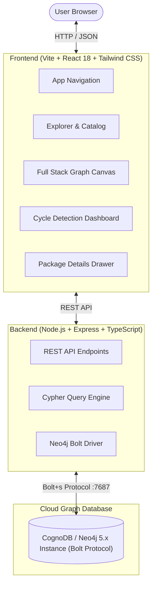

# Stackscope — Tech Stack Dependency Explorer ⚡

> An interactive graph-powered web application for visualizing full-stack technology architectures, exploring multi-hop npm package dependency networks, reverse dependents, and detecting circular loops in real time using **CognoDB** (Neo4j-compatible graph database over Bolt protocol).

---

## 🌟 Features

- **🌐 Full Stack Graph Visualizer**: Interactive force-directed canvas displaying 58+ technologies across 3 structured tiers (Frontend, Languages/Backends, Databases/DevOps) with custom card pills, top/bottom port connection dots, and glowing Bezier spline curves.
- **🔍 Multi-Hop Dependency Traversal (1–3 Hops)**: Native Cypher graph traversals querying direct and transitive downstream dependencies in milliseconds.
- **🔄 Reverse Dependent Lookup ("What depends on me?")**: Trace which upstream tools depend on any given library to assess breaking change impact.
- **🔁 Real-Time Circular Dependency Cycle Detection**: Real-time graph cycle traversal identifying closed dependency loops (e.g. `A ➔ B ➔ C ➔ A`) with risk alerts and interactive loop animation.
- **🏷️ Official Vector Brand Icons**: Real brand logos (`react-icons`, Simple Icons, Devicons) for JavaScript, TypeScript, Python, React, Next.js, Docker, Kubernetes, etc.
- **📊 Curated Tech Catalog**: Browse, search, and filter 58+ packages across 11 categories with real-time autocomplete and npm download statistics.

---

## 🏗️ Architecture & Technology Stack



### Stack Breakdown:
- **Frontend**: React 18, Vite, TypeScript, Tailwind CSS, `react-force-graph-2d`, Lucide Icons, `react-icons` (Simple Icons + FontAwesome)
- **Backend**: Node.js, Express, TypeScript, `neo4j-driver` (Bolt protocol)
- **Database**: CognoDB (Managed Neo4j 5.x Cloud Graph Database)

---

## 📊 Graph Data Model & Cypher Queries

### Nodes (`:Package`)
- `name` (*string*, unique constraint) — Package identifier (e.g. `react`, `next`)
- `version` (*string*) — Semantic version (e.g. `18.3.1`)
- `description` (*string*) — Package description
- `license` (*string*) — License identifier (e.g. `MIT`, `Apache-2.0`)
- `weeklyDownloads` (*integer*) — Average weekly npm downloads

### Relationships (`[:DEPENDS_ON]`)
- `type` (*string*) — Dependency type: `'prod'` | `'dev'` | `'peer'`
- `versionRange` (*string*) — SemVer version range constraint (e.g. `^18.3.0`)

### Core Cypher Queries

#### 1. Multi-Hop Dependency Traversal (1..3 Hops)
```cypher
MATCH path = (root:Package {name: $name})-[:DEPENDS_ON*1..$depth]->(dep:Package)
RETURN root, relationships(path) AS rels, nodes(path) AS nodes, path
```

#### 2. Reverse Dependents ("What depends on this tool?")
```cypher
MATCH (dependent:Package)-[r:DEPENDS_ON]->(target:Package {name: $name})
RETURN dependent
ORDER BY dependent.weeklyDownloads DESC
```

#### 3. Real-Time Circular Dependency Cycle Detection
```cypher
MATCH (p1:Package)-[:DEPENDS_ON]->(p2:Package)
MATCH path = (p2)-[:DEPENDS_ON*1..5]->(p1)
RETURN [p1.name] + [n IN nodes(path) | n.name] AS cycle
LIMIT 20
```

---

## 🚀 Local Development Setup

### Prerequisites
- **Node.js**: v18.0.0 or higher
- **npm** or **pnpm**
- **CognoDB Cloud Instance** (or local Neo4j database)

---

### Step 1: Clone the Repository
```bash
git clone https://github.com/your-username/tech-stack-dependency-explorer.git
cd tech-stack-dependency-explorer
```

---

### Step 2: Backend Setup
1. Navigate into the backend directory:
   ```bash
   cd backend
   npm install
   ```

2. Configure environment variables in `backend/.env`:
   ```ini
   NEO4J_URI=bolt+s://db-057d4b07.bravo.databases.cognodb.com
   NEO4J_USER=cognodb
   NEO4J_PASSWORD=your_password_here
   PORT=3001
   ```

3. Seed the CognoDB database with the 58-node tech stack graph:
   ```bash
   npm run seed
   ```

4. Start the backend development server:
   ```bash
   npm run dev
   ```
   *The backend will run on `http://localhost:3001`.*

---

### Step 3: Frontend Setup
1. In a new terminal window, navigate into the frontend directory:
   ```bash
   cd frontend
   npm install
   ```

2. Configure environment variables in `frontend/.env`:
   ```ini
   VITE_API_URL=http://localhost:3001
   ```

3. Start the Vite development server:
   ```bash
   npm run dev
   ```
   *Open `http://localhost:5173` in your browser.*

---

## 🌐 Production Deployment Guide

### Deploying the Backend to [Render.com](https://render.com)
1. Push your repository to GitHub.
2. In Render, create a **New Web Service** and select your repository.
3. Configure the following settings:
   - **Root Directory**: `backend`
   - **Build Command**: `npm install && npm run build`
   - **Start Command**: `npm start`
4. In **Environment Variables**, add:
   - `NEO4J_URI` = `bolt+s://db-057d4b07.bravo.databases.cognodb.com`
   - `NEO4J_USER` = `cognodb`
   - `NEO4J_PASSWORD` = `c756c3a2634f02d973ad4867aa10dc2d`
   - `PORT` = `3001`
5. Click **Deploy**. Note your live Render URL (e.g. `https://stackscope-api.onrender.com`).

---

### Deploying the Frontend to [Vercel](https://vercel.com)
1. In Vercel, import your GitHub repository.
2. Configure project settings:
   - **Root Directory**: `frontend`
   - **Framework Preset**: `Vite`
   - **Build Command**: `npm run build`
   - **Output Directory**: `dist`
3. In **Environment Variables**, add:
   - `VITE_API_URL` = `https://stackscope-api.onrender.com`
4. Click **Deploy**.

---

## 🔌 API Endpoints Reference

| Method | Endpoint | Description |
| :--- | :--- | :--- |
| `GET` | `/api/packages/search?q=:query` | Search packages by name or category prefix |
| `GET` | `/api/packages/:name/dependencies?depth=1..3` | Get multi-hop downstream dependencies |
| `GET` | `/api/packages/:name/dependents` | Get upstream reverse dependents |
| `GET` | `/api/packages/circular` | Detect and return all circular dependency loops |
| `GET` | `/api/health` | Check CognoDB Bolt database connectivity |

---

## 📝 License

Distributed under the **MIT License**.
